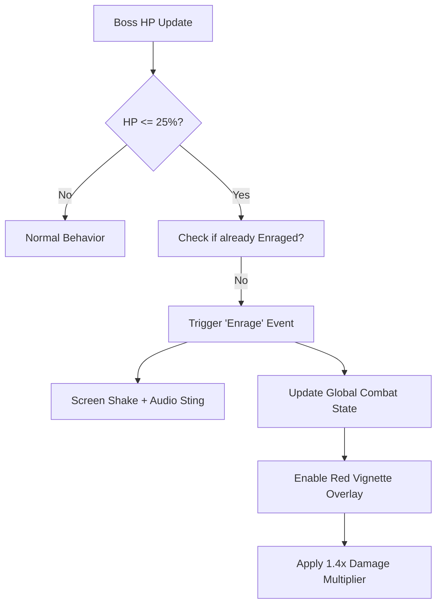

# 📜 Devlog #1: The Bloodline Remembers

### A Personal Note from Mike
For years, I’ve shared my IT adventures—solving complex automation puzzles and navigating the ever-shifting cloud landscape. But behind the scenes, a different kind of architecture has been taking shape. Today, I’m pulling back the curtain on **Mycka Amalia Chronicles**, a dark fantasy roguelite that applies everything I’ve learned about systems engineering to the world of game design.

This isn’t just a game; it’s a living, breathing system where your lineage determines your legacy. Welcome to the first of our weekly "Status of the Game" updates.

---

# Boss Enrage Phases: Making Every Boss Fight Feel Alive

**Game:** Mycka Amalia Chronicles  
**Feature area:** Combat / Boss AI  
**Stack:** React 19 · TypeScript · Zustand · Framer Motion

## ⚔️ The Design Vision
In most games, a boss at 10% health is just a boss with less HP. In the *Amalia* universe, a wounded beast is the most dangerous. We wanted the final stretch of a fight to feel like a desperate struggle for survival.

## What We Built
Each of the nine main bosses now enters an **enrage phase** when their HP drops to 25%. This isn't just a stat buff; it’s a complete atmospheric shift.

### The Feedback Loop
- **Visuals:** A pulsing crimson vignette constricts the player's vision.
- **Physics:** A high-intensity screen shake triggers upon the "Roar" transition.
- **Mechanics:** Damage scales by **1.4x**, and attack patterns shift from defensive to "Berserker" logic.

## 🏗️ Technical Architecture
We used a reactive hook system to ensure the transition is seamless and performant.



## 💻 Under the Hood: The Enrage Hook
One of the challenges was preventing the enrage event from "flickering" if a player heals the boss (or if HP oscillates). We solved this using a `useRef` to lock the state outside of the standard render cycle.

```typescript
// src/hooks/useBossEnrageSystem.ts
export function useBossEnrageSystem(activeBoss, bossMaxHp, combatFeedback) {
  const enragedRef = useRef(false);

  useEffect(() => {
    if (!activeBoss || enragedRef.current) return;
    const ratio = activeBoss.hp / bossMaxHp;
    
    if (ratio <= 0.25) {
      enragedRef.current = true;
      // Trigger the sensory effects
      combatFeedback.triggerShake({ intensity: 18, duration: 600 });
      notify(`⚠ ${activeBoss.name} is Enraged!`);
    }
  }, [activeBoss?.hp]);

  return { isEnraged: enragedRef.current };
}
```

## 🎨 Aesthetic DNA
To maintain consistency, this feature uses our **Cold Crimson (#BE123C)** palette for all enrage UI elements, ensuring the player immediately recognizes the "Danger Zone" through color association alone.

---

**Next Week:** We dive into the **Procedural Royal Quarters**—how we generate a castle that never looks the same twice.

*Stay tuned to the Chronicles.*
#gamedev #roguelite #MyckaAmalia #Tauri
