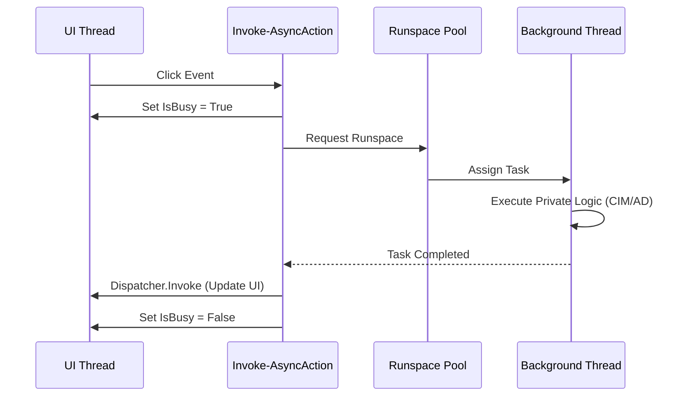
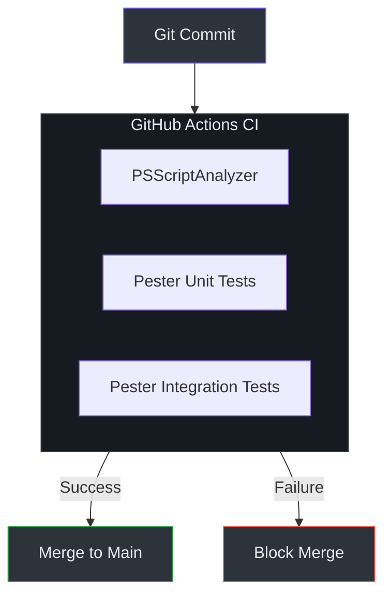

# Architecture Deep Dive

This document provides a low-level technical analysis of the LazyWinAdmin 2026 enterprise architecture.

## WPF & XAML Integration

The transition from WinForms to WPF was driven by the need for DPI-aware interfaces and a declarative UI definition.

### UI Definition
The UI is defined in `LazyWinAdminModule/UI/MainView.xaml`. This file contains the layout, styling, and data-binding templates. By separating XAML from PowerShell, we allow designers to modify the UI without touching the logic.

### Loading Mechanism
The module loads the XAML at runtime using the `[Windows.Markup.XamlReader]` class.
*(Reference: LazyWinAdminModule/Public/Start-LazyWinAdmin.ps1:38)*

```powershell
$xmlReader = [System.Xml.XmlNodeReader]::new([System.Xml.XmlDocument]::new().LoadXml($xamlContent))
$window = [System.Windows.Markup.XamlReader]::Load($xmlReader)
```

## Runspaces & Async Execution

To ensure the UI remains responsive during long-running remote queries, LazyWinAdmin implements a sophisticated Runspace-based multi-threading model.

### The Runspace Pool
A `RunspacePool` is initialized within the `LazyWinAdminState` class. This pool manages a collection of PowerShell runspaces that can be reused for background tasks.
*(Reference: LazyWinAdminModule/Classes/ApplicationState.ps1:12)*

### `Invoke-AsyncAction` Pattern
This core helper function orchestrates the execution flow between the UI thread and the background threads.


*(Reference: LazyWinAdminModule/Public/Start-LazyWinAdmin.ps1:115)*

## State Management

Application state is encapsulated in the `LazyWinAdminState` PowerShell class.

### Thread-Safe Synchronization
To pass data safely between the UI thread and background threads, we use a **Synchronized Hashtable** (`SyncHash`). This object is wrapper around a standard hashtable that provides thread-safe access.
*(Reference: LazyWinAdminModule/Classes/ApplicationState.ps1:8)*

```powershell
$this.SyncHash = [hashtable]::Synchronized(@{})
```

## Business Logic Modules (CIM vs WMI)

One of the primary modernization tasks was migrating from `Get-WmiObject` to `Get-CimInstance`.

| Feature | Legacy (WMI) | Modern (CIM) |
| :--- | :--- | :--- |
| **Protocol** | DCOM (RPC) | WS-Man (WinRM) |
| **Firewall** | Difficult (Dynamic Ports) | Easy (TCP 5985/5986) |
| **Performance** | Slower, blocking | Faster, optimized |
| **Platform** | Windows Only | Cross-platform ready |

### Implementation Example: Hardware Inventory
The `Get-ComputerHardware` function utilizes CIM sessions to retrieve manufacturer, model, and disk information.
*(Reference: LazyWinAdminModule/Private/Get-ComputerHardware.ps1:1)*

## Testing & Quality Control

We utilize **Pester** for all logic validation. Tests are structured to mock remote environments where possible to ensure logic consistency without needing active server connections during CI.
*(Reference: LazyWinAdminModule/Tests/Get-ComputerUptime.Tests.ps1:1)*


