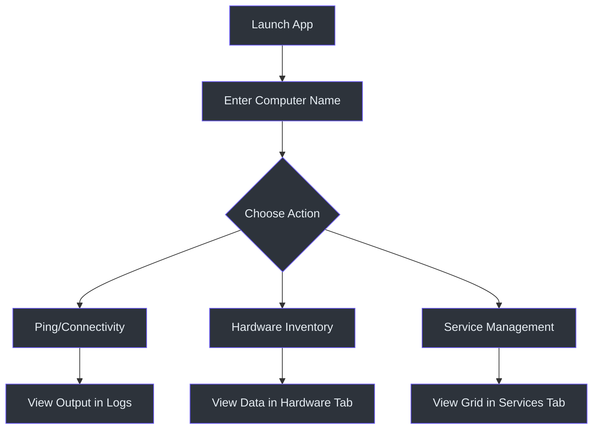

# Getting Started

LazyWinAdmin has been modernized for the 2026 enterprise environment. This guide covers how to get up and running.

## Prerequisites

Before using LazyWinAdmin, ensure your environment meets these requirements:

- **OS**: Windows 10/11 or Windows Server 2019/2022/2025.
- **PowerShell**: Version 7.4+ is highly recommended for best performance and threading stability.
- **Remoting**: WinRM must be enabled on target systems for CIM and Service management tasks.
- **Permissions**: Administrative rights on the target system are required for most queries.

## Installation

### 1. Download/Clone
Clone the repository to your local machine:
```powershell
git clone https://github.com/dutch2005/LazyWinAdmin_GUI.git
```

### 2. Module Import
LazyWinAdmin is now a structured PowerShell Module. Import it using the manifest file:
```powershell
Import-Module ./LazyWinAdminModule/LazyWinAdminModule.psd1 -Force
```
*(Reference: LazyWinAdminModule/LazyWinAdminModule.psd1:1)*

## Basic Usage

To launch the application, run the exported function:
```powershell
Start-LazyWinAdmin
```
*(Reference: LazyWinAdminModule/Public/Start-LazyWinAdmin.ps1:1)*

### Workflow Example: Querying a Remote Server



## Quick Reference Commands

| Goal | Method |
| :--- | :--- |
| **Start UI** | `Start-LazyWinAdmin` |
| **Check Uptime** | Use System Tab -> Uptime Button |
| **Manage Services** | Use Services Tab -> Search & Manage |
| **Inventory** | Use Hardware/Software Tabs |
| **Debug** | Check Logs Tab for real-time Runspace output |

## Troubleshooting

- **UI Freezes**: If the UI becomes unresponsive, check if a large AD query is running. The app uses Runspaces, but extremely high resource usage can still impact the main thread.
- **Access Denied**: Ensure you are running PowerShell as Administrator and that your account has permissions on the remote system.
- **Missing CIM Data**: Verify WinRM is active: `Test-WsMan -ComputerName <Target>`.
