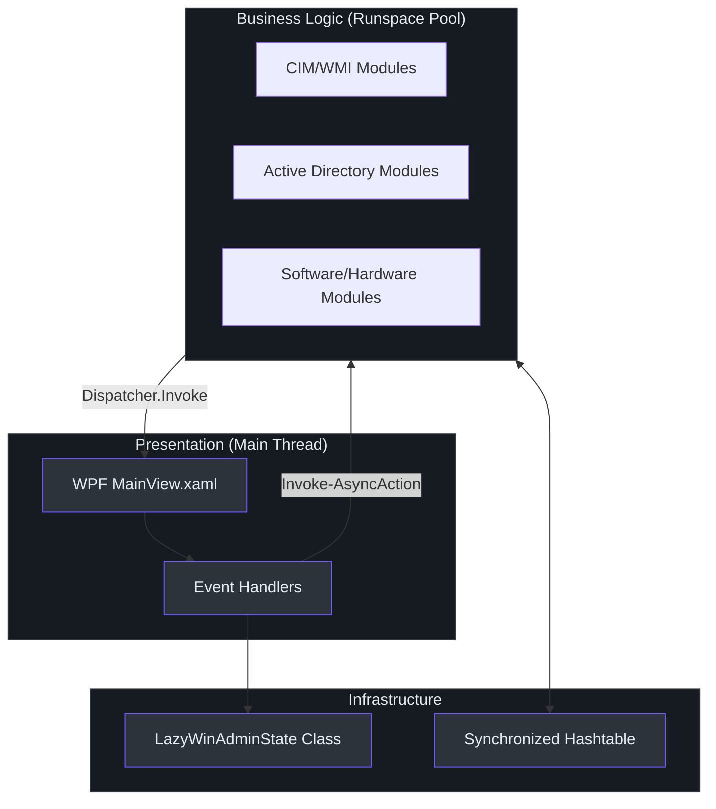
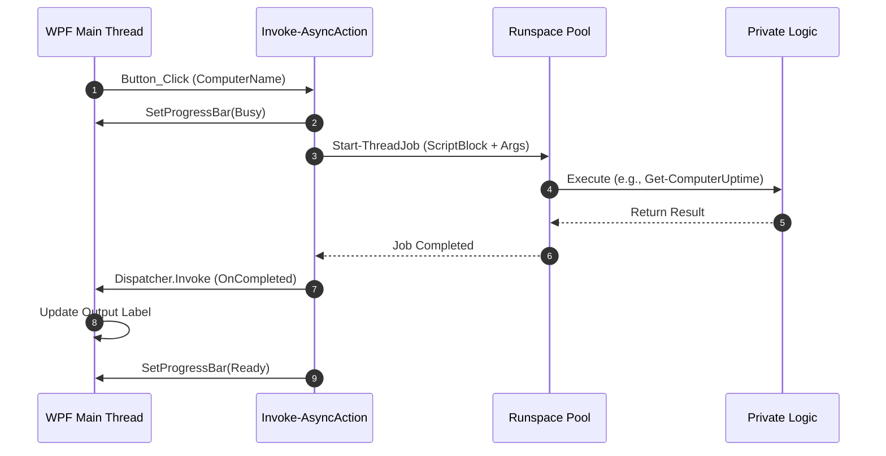

# Principal-Level Onboarding Guide

Welcome to the 2026 modernization of LazyWinAdmin. This document outlines the architectural philosophy and core invariants of the system.

## System Philosophy & Design Principles

LazyWinAdmin has evolved from a monolithic PowerShell script into a modular, enterprise-grade RMM tool. The core invariant of the 2026 version is **UI Responsiveness**. In previous versions, long-running WMI or AD queries would "freeze" the WinForms interface. The modern version solves this through strict separation of concerns and multi-threading.

### Core Architectural Choice: Async-First
Every remote operation (CIM, AD, Ping) MUST execute in a background Runspace. The main thread is reserved exclusively for the WPF UI loop.

**Pseudocode Comparison (C# vs PowerShell):**
```csharp
// C# equivalent of our PowerShell pattern
public async Task RunQuery(string computer) {
    SetBusy(true);
    var result = await Task.Run(() => GetCimData(computer));
    UpdateUI(result);
    SetBusy(false);
}
```

```powershell
# Our PowerShell Implementation (Start-LazyWinAdmin.ps1:115)
Invoke-AsyncAction -ScriptBlock { Get-CimData -Computer $t } -OnCompleted { param($res) Update-UI $res }
```

## Architecture Overview

The system follows a modular pattern with a centralized state controller.



## Key Abstractions

1.  **`LazyWinAdminState` Class** `(LazyWinAdminModule/Classes/ApplicationState.ps1:3)`: Encapsulates the `RunspacePool` and the `SyncHash`. This is the single source of truth for the application's lifecycle.
2.  **`Invoke-AsyncAction` Helper** `(LazyWinAdminModule/Public/Start-LazyWinAdmin.ps1:115)`: A higher-order function that abstracts the complexity of starting a `ThreadJob`, passing arguments safely into a fresh runspace, and marshalling the result back to the WPF Dispatcher.

## Data Flow: Async Command Execution

When a user clicks a button (e.g., "Ping"), the following sequence occurs:



## Dependency Rationale

| Dependency | Purpose | Replaces |
| :--- | :--- | :--- |
| **WPF (XAML)** | Modern, DPI-aware vector UI. | WinForms (raw System.Windows.Forms) |
| **RunspacePool** | Managed multi-threading for performance. | Single-threaded execution |
| **CIM Cmdlets** | Modern WS-Man based remote management. | WMIv1 (Get-WmiObject) |
| **Pester** | Automated unit and integration testing. | Manual verification |

## Known Technical Debt & Strategic Direction

- **PowerShell 5.1 Fallback**: While optimized for PS 7.4+ `(LazyWinAdminModule/LazyWinAdminModule.psd1:10)`, some logic still uses older .NET types for widest compatibility.
- **Credential Management**: Currently relies on the execution context's credentials. Future roadmap includes `PSCredential` delegation via the `LazyWinAdminState`.

## References
- `LazyWinAdminModule/Classes/ApplicationState.ps1`
- `LazyWinAdminModule/Public/Start-LazyWinAdmin.ps1`
- `LazyWinAdminModule/Private/Get-ComputerHardware.ps1`
- `LazyWinAdminModule/UI/MainView.xaml`
- `lazywinadmin-modernization.md`
