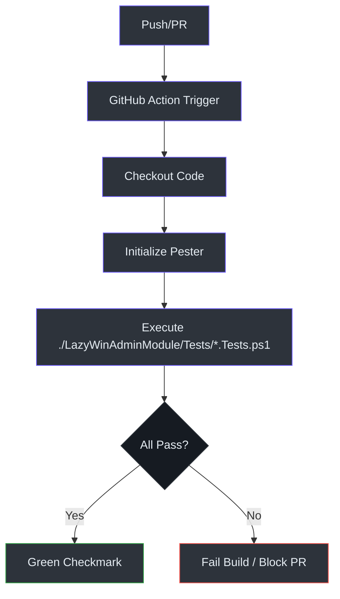

# Quality & Contribution

Maintaining enterprise-grade quality in a community-driven project requires rigorous automated testing and clear contribution guidelines.

## Testing Strategy: Pester

We use **Pester**, the ubiquitous PowerShell testing framework, for all code validation.

### Test Structure
Tests are located in `LazyWinAdminModule/Tests/` and follow the `*.Tests.ps1` naming convention.

| Test Type | Target | Focus |
| :--- | :--- | :--- |
| **Unit Tests** | `Private/` functions | Logic consistency and error handling without remote connections. |
| **Integration Tests** | `Public/` and `UI` | End-to-end flow from button click to output. |

### Example: Service Management Test
The following test ensures that `Get-ComputerService` correctly filters for stopped automatic services.
*(Reference: LazyWinAdminModule/Tests/Get-ComputerService.Tests.ps1:1)*

```powershell
Describe "Get-ComputerService Logic" {
    It "Filters stopped automatic services correctly" {
        $mockServices = @(
            [PSCustomObject]@{ Status = 'Stopped'; StartType = 'Automatic'; Name = 'Svc1' },
            [PSCustomObject]@{ Status = 'Running'; StartType = 'Automatic'; Name = 'Svc2' }
        )
        # ... logic validation ...
    }
}
```

## CI/CD Pipeline: GitHub Actions

Every push to `main` or pull request triggers our automated verification pipeline.

### Workflow: PowerShell Pester Tests
The pipeline executes on an `ubuntu-latest` runner using `pwsh` (PowerShell Core). It automatically discovers and runs all Pester tests in the repository.
*(Reference: .github/workflows/powershell-tests.yml:1)*



## Contribution Guidelines

1.  **Branching**: Create a feature branch from `main` (e.g., `feat/my-new-tab`).
2.  **Logic First**: Implement your logic in a new file within `LazyWinAdminModule/Private/`.
3.  **Test Always**: Add a corresponding Pester test in `LazyWinAdminModule/Tests/`.
4.  **UI Integration**: Add necessary XAML to `MainView.xaml` and register events in `Start-LazyWinAdmin.ps1`.
5.  **Documentation**: Update the `README.md` or wiki pages if your change introduces new requirements or core features.

---
*Thank you for helping keep LazyWinAdmin modernized and stable.*
